# Adapting TFCE to EEG/ERP data from different experimental designs in cognitive neuroscience
   

## Overview
This is the code for the tutorial ***Adapting TFCE to EEG/ERP data from different experimental designs in cognitive neuroscience***.

This project aims to inform cognitive neuroscientist of adapting TFCE to EEG/ERP data from their own experiments. The experimental designs involved in this project are:

**Complex Experimental Varaibles**
1. Simple (one manipulated variable with two levels) between-subject design without any covariates;
2. 2-by-2 factorial between-subject designs without any covariates;
3. Simple between-subject design with covariates;

**Complex Experimental structures or units relationship**
1. Simple within-subject design;
2. Simple between-and-witin subject design (also called mixed design or spilt-plot design);
3. Simple fully-nested experimental structure (e.g., class-student, testing within-subject effects)
4. Simple fully-crossed experimental structure (e.g., within-subject and within item)

## Table of Contents:
-[Simulated Data](#Data Simulation)

-[MATLAB Code](#MATLAB)

-[Python Code] (#Python)

-[R Code] (#R)

The respo include MATLAB, R, and Python implemtation of TFCE.
## Simulated data

***Simple (one manipulated variable with two levels) between-subject design without any covariates***

The ground-truth is [P300 efffect with 3.0 ](./Figures/01_simGroundEffect_betweenSubject_Simple.jpg) as follows:
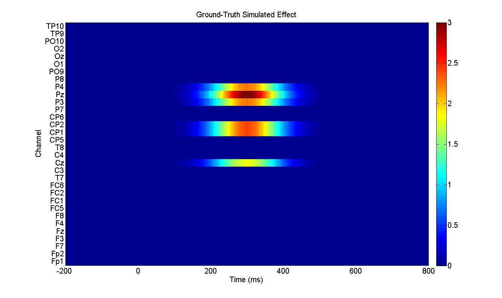. 

Other visualized results are the following:
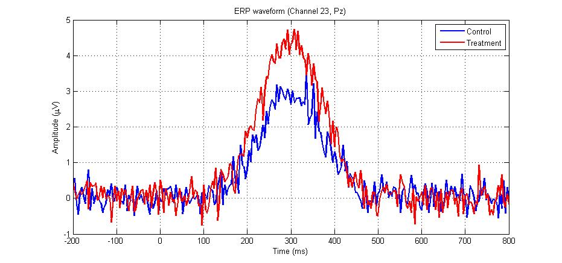,  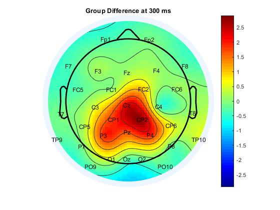, 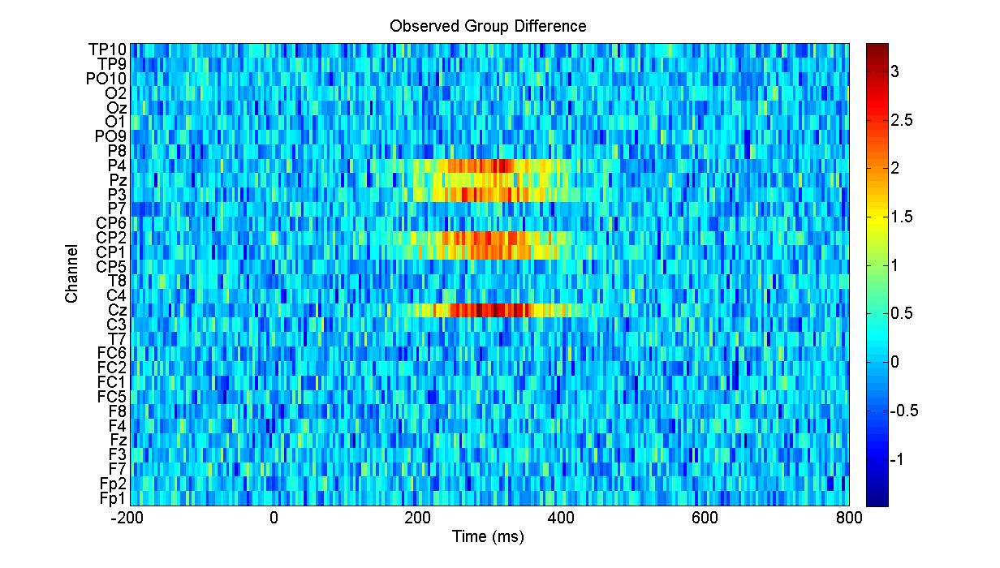

***2-by-2 factorial between-subject design without any covariates***

The ground-truth is [P300 efffect with 3.0 for variable A](./Figures/02_simGroundEffect_betweenSubject_2by2A.jpg) as follows:
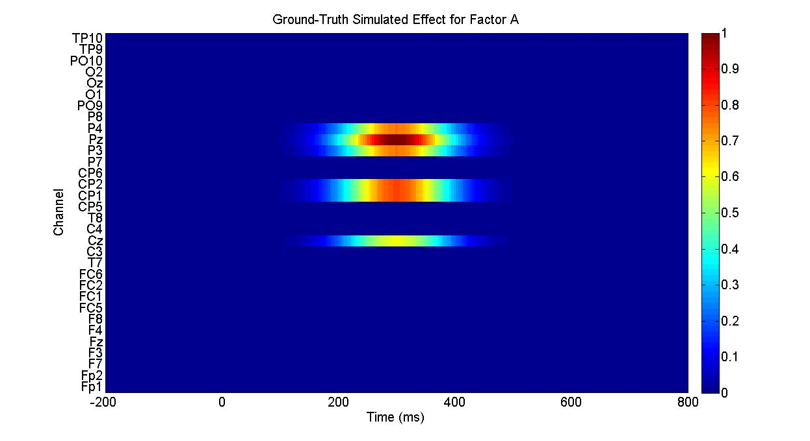. 
. 

Other visualized results are the following:
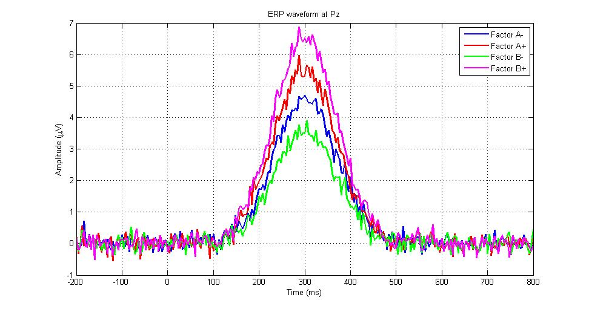, 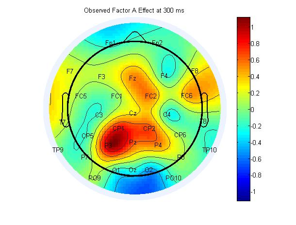, 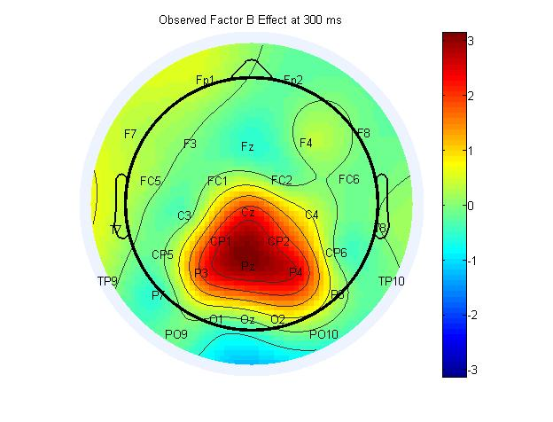, 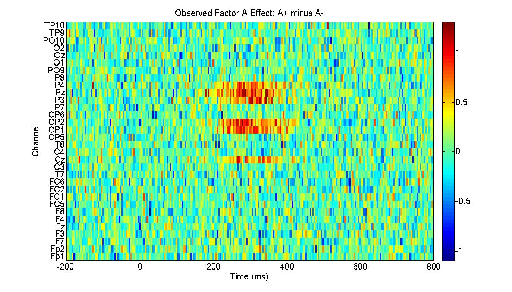, 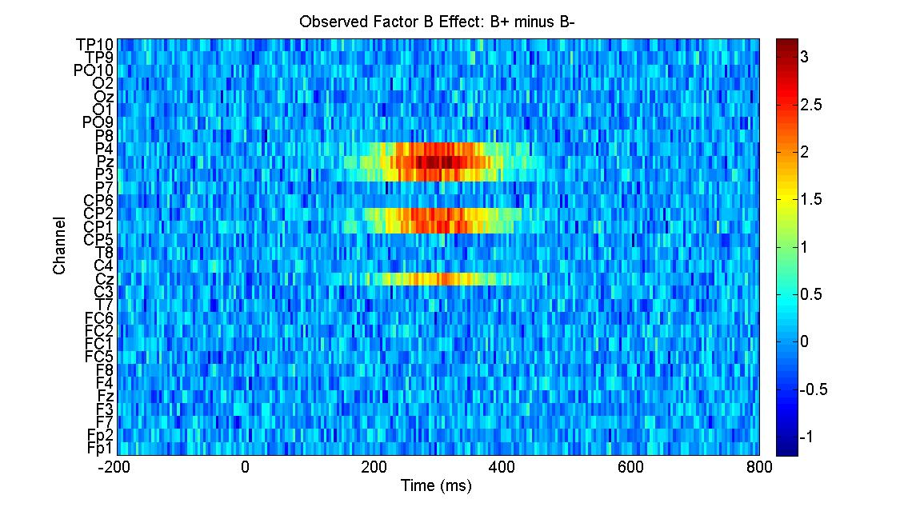

## MATLAB
***Simple (one manipulated variable with two levels) between-subject design without any covariates***

The output of TFCE is .

***2-by-2 factorial between-subject design without any covariates***

The output of TFCE is 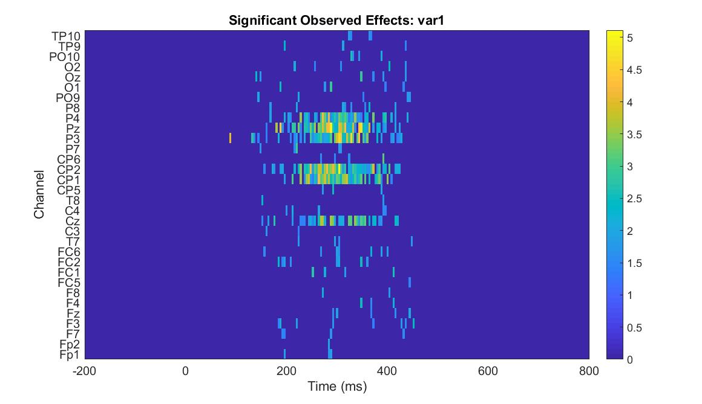, and .

## Required packages

### Usage

## R

### Required packages

### Usage
